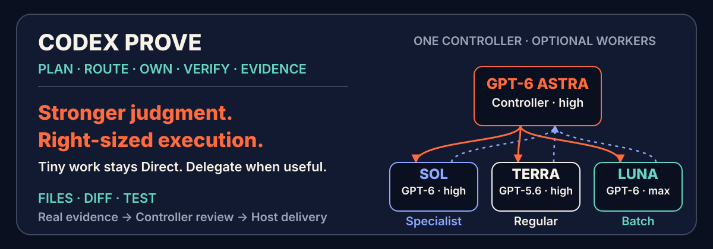
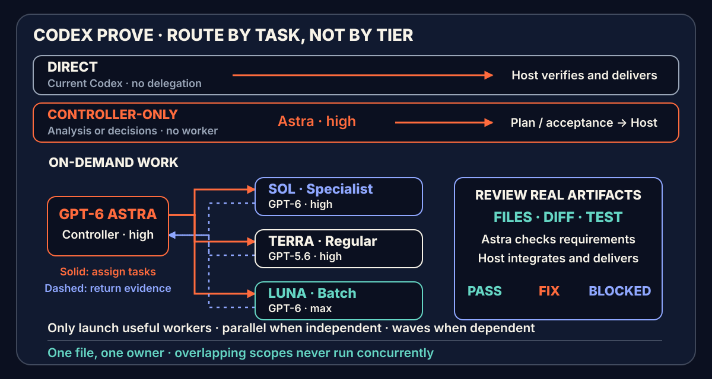

[简体中文](README.md) · [English](README.en.md)



<p align="center">
  <a href="https://github.com/yehyakin/codex-prove/releases/tag/v1.0.0"></a>
  <a href="https://github.com/yehyakin/codex-prove/actions/workflows/posix-validation.yml"></a>
  <a href="https://github.com/yehyakin/codex-prove/actions/workflows/windows-validation.yml"></a>
  <a href="LICENSE"></a>
  <a href="https://github.com/yehyakin/codex-prove/stargazers"></a>
</p>

# Codex PROVE

**Plan the work. Route the right model. Prove the result.**

`codex-prove` is an explicit, model-neutral orchestration Skill for Codex: **one controller makes decisions and performs final review; workers are selected as needed for bounded execution.**

[60-second quickstart](#60-second-quickstart) · [Routes](#how-it-works) · [Cost model](#why-it-can-reduce-cost) · [Runtime evidence](#current-status) · [Install and maintenance](#install-check-and-uninstall)

You provide the goal, completion criteria, and constraints. PROVE handles planning, capability routing, file ownership, staged execution, verification, and evidence review.

- **Controller** is the sole decision owner: understand, plan, route, assign ownership, schedule, and perform the final review.
- **Specialist worker** handles difficult independent implementation, root-cause analysis, or targeted read-only review.
- **Regular worker (Complex worker profile)** handles routine features, fixes, tests, and integration under settled requirements.
- **Efficient worker** handles mechanical batches with explicit rules and objective checks; one-line edits need no delegation.

Simple tasks stay with the current Codex session. Explicitly invoke `$codex-prove` for work that is complex, cross-module, parallelizable, or high-consequence.

Runtime output defaults to Simplified Chinese unless the user explicitly requests another language.

> **Previous stable v1.0.0 record:** 115 tests, 39 Forward scenarios, POSIX and Windows PowerShell 5.1/7 CI, and a real fresh-session Compatibility route.

Canonical repository: [yehyakin/codex-prove](https://github.com/yehyakin/codex-prove). This is an independent community project, not an official OpenAI product or endorsement.

## v1.1 development: stronger controller, less ceremony

**Astra coordinates, Sol tackles difficult units, Terra handles regular work,
and Luna runs mechanical batches; tiny tasks stay Direct.**
The controller uses GPT-6 Astra / high and selects GPT-6 Sol / high, GPT-5.6 Terra / high, or
GPT-6 Luna / max as needed. Tasks do not need every model or a tier-by-tier relay.

- Small tasks stay **Direct, with zero delegation**, even when explicitly invoked.
- An authoritative selection record allows a complete first-turn task; no idle self-attestation round.
- Authorized local implementation, tests, and repairs continue without repeated approval. A missing heading or one failing test is not automatically `BLOCKED`.
- One active writer per scope; ownership can transfer after the previous worker and its processes stop and the actual diff is preserved.
- **Ponytail-inspired minimal implementation** favors existing code, standard libraries, and platform features without permanent hooks, modes, or new approval steps.

This describes the development branch, not a published release. See the [v1.1 audit and validation record](docs/release/v1.1-gpt6-audit.md) for evidence and limits.

The September 26 decision confirms this candidate's defaults: **Astra controls,
Sol handles specialist work, Terra handles regular work, and Luna handles batches**.
Sol and Luna move to the new generation while preserving effort, scope, and role IDs;
Terra remains the regular worker rather than being replaced merely because a new model shipped.
Jev is used only for development research, not default routing or installation/runtime dependencies.

## Core routing and projected savings

> **Historical scope:** this table and the detailed calculations retain the v1.0 Sol controller and **2026-08-04** rate snapshot. They do not describe the v1.1 Astra default. There is no matched cost measurement for the new configuration; neither these percentages nor Ponytail's upstream savings can be reused for it.


The table below uses an “all work performed by Sol” baseline of `1.00×`. Model token shares total 100%. `Orchestration overhead` represents additional Sol planning, review, coordination, and necessary rework as a fraction of the all-Sol baseline.

| Scenario | Example token routing | Orchestration overhead | Projected saving |
| --- | --- | ---: | ---: |
| **Ordinary clear project** | Sol 10% · Terra 20% · Luna 70% | 3%–7% | **72.2%–76.2%** |
| **Mixed project** | Sol 20% · Terra 40% · Luna 40% | 2%–12% | **50.4%–60.4%** |
| **Complex project** | Sol 25% · Terra 60% · Luna 15% | 7%–17% | **33.4%–43.4%** |
| **Direct small task** | The current Codex completes it without delegation | 0% | **0% routing saving** |

These ranges are `scenario_model_projection` values based on public rates and example token shares. They are for budget planning, **not per-task guarantees or latency promises**.

## 60-second quickstart

### macOS / Linux

```sh
git clone https://github.com/yehyakin/codex-prove.git
cd codex-prove

bash scripts/validate.sh
bash scripts/install.sh
```

### Windows

Windows PowerShell 5.1:

```powershell
git clone https://github.com/yehyakin/codex-prove.git
Set-Location codex-prove

powershell.exe -NoProfile -ExecutionPolicy Bypass -File scripts/validate.ps1
powershell.exe -NoProfile -ExecutionPolicy Bypass -File scripts/install.ps1
```

PowerShell 7:

```powershell
pwsh -NoProfile -File scripts/validate.ps1
pwsh -NoProfile -File scripts/install.ps1
```

Open a new Codex session after installation:

```text
$codex-prove

Goal: Add account settings to the existing application.
Done when: Users can update their display name and avatar; existing authentication APIs remain compatible; tests and build pass.
Constraints: Do not modify payments and do not replace the existing UI framework.
```

A one-line request also works:

```text
$codex-prove Refactor the authentication module, preserve the current API, and make sure tests and build pass.
```

You do not need to choose a worker count or model. The controller creates the smallest useful execution graph.

## Decide whether orchestration is worth it

| Keep the current Codex Direct | Explicitly use `$codex-prove` |
| --- | --- |
| One file, a small edit, or a located issue | Multiple modules, strong dependencies, shared interfaces, or high-consequence changes |
| Simple answers, deterministic commands, or short text | Decomposition, parallelism, ownership, or independent evidence review matters |
| Orchestration costs more than implementation | Rework costs more than planning and review |

PROVE is neither the default mode nor a permanent agent team. It uses workers only when orchestration can improve delivery quality or reduce total cost.

## Why it can reduce cost

The cost strategy is straightforward:

> **Keep goal interpretation, boundary decisions, and final review with Sol; route implementation to Terra or Luna according to complexity.**

Using the official API prices and Codex token-based rate card checked on **2026-08-04**, the relative cost of the same token type is:

| Model | Relative cost | Responsibility in this project |
| --- | ---: | --- |
| **Sol** | **1.00×** | Understand, plan, assign, schedule, and review |
| **Terra High** | **0.40×** | Complex, cross-module, long-context, or high-risk execution |
| **Luna Max** | **0.04×** | Clear, low-ambiguity, high-throughput execution |

For the same token type:

- Terra costs about **40%** of Sol;
- Luna costs about **4%** of Sol;
- Luna does not replace Sol—it moves large amounts of well-specified execution away from Sol while preserving Sol's judgment and review role.

These values are `scenario_model_projection`: they are planning estimates, **not matched A/B experiments, not per-task guarantees, and not latency promises**. Repeated context, poor decomposition, parallel waiting, output volume, Fast mode, and rework can reduce or reverse the saving.

Under those historical assumptions, the budget example is:

> **Ordinary clear projects can project roughly 72%–76% savings, typical mixed projects roughly 50%–60%, and complex projects roughly 33%–43%; actual results must be recalculated from real routing and token usage.**

It is not accurate to compress every workload into a fixed “56% average saving.”

<details>
<summary><strong>View official rates, formula, and full calculation</strong></summary>

### API prices

Per 1M tokens:

| Model | Input | Cached input | Output |
| --- | ---: | ---: | ---: |
| GPT-5.6 Sol | $5.00 | $0.50 | $30.00 |
| GPT-5.6 Terra | $2.00 | $0.20 | $12.00 |
| GPT-5.6 Luna | $0.20 | $0.02 | $1.20 |

### Codex token-based credits

Per 1M tokens:

| Model | Input | Cached input | Output |
| --- | ---: | ---: | ---: |
| GPT-5.6 Sol | 125 credits | 12.5 credits | 750 credits |
| GPT-5.6 Terra | 50 credits | 5 credits | 300 credits |
| GPT-5.6 Luna | 5 credits | 0.5 credits | 30 credits |

The relative ratios were identical across both accounting surfaces in that snapshot:

```text
Sol = 1.00
Terra = 0.40
Luna = 0.04
```

That allows the same relative-cost formula:

```text
route_cost =
  sol_share × 1.00
  + terra_share × 0.40
  + luna_share × 0.04
  + orchestration_overhead

saving = 1 - route_cost
```

Ordinary clear project example:

```text
route_cost
= 0.10 × 1.00
+ 0.20 × 0.40
+ 0.70 × 0.04
+ 0.03–0.07
= 0.238–0.278

saving
= 1 - 0.238–0.278
= 72.2%–76.2%
```

API users see dollar charges; ChatGPT / Codex users usually see credits or included capacity. They are different accounting units, so API dollar savings should not be described as an identical subscription-bill saving.

Official sources:

- [OpenAI model comparison](https://developers.openai.com/api/docs/models/compare)
- [OpenAI Codex rate card](https://help.openai.com/en/articles/20001106-codex-rate-card)

A small subset of Enterprise workspaces still using the legacy rate card should use the rate card that actually applies to their workspace.

</details>

## What it solves

| Common problem | Codex PROVE's response |
| --- | --- |
| One agent plans, implements, and verifies too much at once | The controller owns judgment and review; workers own bounded execution |
| Every task uses the highest-cost model | Execution is routed to specialist, regular, or efficient capability profiles as needed |
| Multiple executors touch shared files | **One file, one owner**; overlapping work runs sequentially |
| “Done” is reported without inspectable proof | Results must include changed paths, diff, tests, builds, or artifacts |
| A failed task is retried indefinitely | Continue with new evidence; stop a path at repeated no-progress or a real boundary |

The goal is not a noisy multi-agent team. It is a clear, auditable control plane for complex work.

## How it works



The image retains the v1.0 two-worker overview. v1.1 adds an independent specialist;
its current paths are shown below.

```text
User goal
   │
   ▼
Host: lightweight routing
   ├─ Direct: the current Codex handles simple work
   └─ Complex work → Controller: plan → route → assign → schedule
                         ├─ Controller-only: planning, analysis, or review
                         ├─ Specialist worker: difficult independent execution / review
                         ├─ Regular worker (Complex worker profile): routine implementation / tests
                         └─ Efficient worker: mechanical batches
   │
   ▼
Real files + diff + test / build / artifact evidence
   │
   ▼
Coordinated work: Controller review by REQ-ID → PASS / FIX / BLOCKED → Host delivery
```

<details>
<summary><strong>Roles, parallelism, and recovery</strong></summary>

### Current default profiles

| Role | Configuration | Boundary |
| --- | --- | --- |
| Controller | `prove-controller` → `gpt-6-astra` / `high` / `read-only` | One controller for planning, assignment, and final review |
| Specialist worker | `prove-specialist-worker` → `gpt-6-sol` / `high` / `workspace-write` | Difficult independent execution or targeted read-only review; not a second controller |
| Regular worker | `prove-complex-worker` → `gpt-5.6-terra` / `high` / `workspace-write` | Regular features, fixes, tests, and integration; existing ID retained for installation compatibility |
| Efficient worker | `prove-efficient-worker` → `gpt-6-luna` / `max` / `workspace-write` | Mechanical batches with explicit rules and objective checks |

The hardest inseparable system-wide decisions remain with Astra. No worker may
create subagents. Read-only packets grant an empty write scope even when the
runtime technically permits writes.

The v1.0 controller used `gpt-5.6-sol`. Role names do not change with model generations; a model update also needs validation, not just a renamed label.

### Boundaries that remain

1. **One active owner.** Disjoint tasks can run in parallel. Shared files, configuration, and side effects run sequentially or in waves, within live capacity.
2. **Safe handoffs.** Stop the previous worker and its mutating processes, inspect and preserve the actual diff, user changes, and attempt history, then assign a new owner. A timeout is not proof of termination.
3. **Real evidence.** The controller checks requirements, actual files/diff, verification output, and coverage. A worker `PASS` or transport `completed` is not acceptance.
4. **Proportional verification.** Later edits invalidate affected evidence only. Reuse fresh evidence for unchanged candidates. No full build for a typo; no existence-only check for a migration.
5. **Progress-based correction.** `FIX` continues authorized scoped work. Stop a path after two consecutive no-progress attempts and reassess; changing agents does not reset history.
6. **Genuine blockers.** Request input for new authority, consequential missing choices, or no safe next action, not routine tests or missing headings. Unavailable models must still be reported without silent substitution.
7. **Less code, not less functionality.** Ponytail-inspired reuse cannot remove required validation, error handling, accessibility, or requested behavior.
8. **No pretend isolation.** Before/after snapshots show net changes, not proof that no temporary write occurred. High-risk operations still need authorization and enforceable boundaries.

Use Native Nested only when supported and demonstrated by an actual launch. Otherwise the Host dispatches the controller's plan and returns artifacts for review: Compatibility. Missing nesting alone does not create a new approval requirement.

| Verdict | Meaning |
| --- | --- |
| `PASS` | Every requirement has real evidence for the current candidate |
| `FIX` | A problem can still be resolved inside existing authorization |
| `BLOCKED` | No safe authorized next step, with the specific reason |

The detailed protocol is maintained in [orchestration.md](.agents/skills/codex-prove/references/orchestration.md) and the on-demand [runtime-notes.md](.agents/skills/codex-prove/references/runtime-notes.md).

</details>

## When not to use it

The current Codex session is usually better for:

- a small change to one well-understood function;
- a localized typo, copy, or styling fix;
- code explanation, question answering, or short-form writing;
- work that cannot be divided into independent write scopes;
- tasks where orchestration, repeated context, and review cost more than implementation.

`$codex-prove` is not the default for everything. **Keep small work Direct; orchestrate only when complexity justifies it.**

## Install, check, and uninstall

### macOS / Linux

```sh
bash scripts/validate.sh
bash scripts/install.sh --check
bash scripts/install.sh

bash scripts/uninstall.sh
bash scripts/uninstall.sh --restore-latest
```

### Windows

```powershell
# Windows PowerShell 5.1
powershell.exe -NoProfile -ExecutionPolicy Bypass -File scripts/validate.ps1
powershell.exe -NoProfile -ExecutionPolicy Bypass -File scripts/install.ps1
powershell.exe -NoProfile -ExecutionPolicy Bypass -File scripts/uninstall.ps1
powershell.exe -NoProfile -ExecutionPolicy Bypass -File scripts/uninstall.ps1 -RestoreLatest

# PowerShell 7
pwsh -NoProfile -File scripts/validate.ps1
pwsh -NoProfile -File scripts/install.ps1
pwsh -NoProfile -File scripts/uninstall.ps1
pwsh -NoProfile -File scripts/uninstall.ps1 -RestoreLatest
```

The lifecycle scripts manage only project-owned Skill and agent files. They preserve unrelated agents and the user's `~/.codex/config.toml`. Set `ORCHESTRATE_HOME` to a temporary home for isolated lifecycle tests.

The installer can migrate managed v0.1–v0.5 installs. It verifies the previous Skill, agents, and ownership state, backs them up, and atomically installs to `~/.agents/skills/codex-prove` and `~/.codex/codex-prove`. v1.0 also installs the `$sol-control` compatibility entry. `--restore-latest` restores the complete manageable pre-upgrade state. The installer refuses user-modified, unowned, or checksum-invalid collisions.

See [`docs/release/runtime-surface-matrix.md`](docs/release/runtime-surface-matrix.md) for platform and evidence coverage.

## Current status

The previous stable version is **[v1.0.0](https://github.com/yehyakin/codex-prove/releases/tag/v1.0.0)**.

> **Migration:** Sol Control is now Codex PROVE. Use `$codex-prove`; `$sol-control` remains an explicit compatibility alias for v1.0. The installer can transactionally migrate managed v0.1–v0.5 installs, and `--restore-latest` restores the pre-upgrade state.

The following table is historical v1.0 evidence, not a v1.1 test report.

| Verification surface | Recorded evidence |
| --- | --- |
| Local repository | Both v1.0.0 Skill Creator entries, static validation, POSIX lifecycle checks, and all 115 tests pass; 39 Forward scenarios cover routing, ownership, evidence, and failure gates |
| Matched smoke | v0.5.0 recorded one matched live smoke; v1.0 changes branding, role names, and migration, so the old smoke is not presented as proof of the new agent names |
| Hosted CI | [POSIX workflow](https://github.com/yehyakin/codex-prove/actions/workflows/posix-validation.yml): Ubuntu/macOS × Python 3.11/3.13; [Windows workflow](https://github.com/yehyakin/codex-prove/actions/workflows/windows-validation.yml): Windows Server 2022 / `windows-latest` × Windows PowerShell 5.1 / PowerShell 7 |
| Physical Windows install | User-reported installation success; the Windows version, install log, and runtime identity payload were not captured, so this does not establish Native Nested |
| v1.0 runtime evidence | Fresh sessions discovered `$codex-prove` and the `$sol-control` compatibility entry; Host/tool mappings and two-turn handshakes passed for `prove-controller`, `prove-complex-worker`, and `prove-efficient-worker` |
| Runtime surface | Compatibility completed Controller planning, Host dispatch, and same-Controller final review with the new role names; Native Nested and physical Windows 11 runtime support remain separately unverified |

v1.0.0 decouples the brand, Skill, and agent roles from specific model names while retaining Requirement IDs, artifact-first review, verify-the-verifier checks, a bounded read-only challenge, and a resume packet. See the [v1.0.0 implementation report](CODEX_PROVE_V1_IMPLEMENTATION_REPORT.md) for the final evidence. The [historical implementation report](SOL_CONTROL_IMPLEMENTATION_REPORT.md) retains the model-branded release history.

These statements describe the recorded evidence boundary; they do not infer support for unverified runtime surfaces.

## Repository layout

```text
.agents/skills/
├─ codex-prove/                canonical Skill and invocation entry
│  ├─ SKILL.md
│  └─ references/
│     ├─ orchestration.md      orchestration contract
│     ├─ runtime-notes.md      runtime and capability profiles
│     └─ ponytail-license.txt  upstream MIT attribution
└─ sol-control/                explicit v1.0 compatibility entry

.codex/agents/
├─ prove-controller.toml
├─ prove-specialist-worker.toml
├─ prove-complex-worker.toml
└─ prove-efficient-worker.toml

scripts/
├─ validate.*
├─ install.*
├─ uninstall.*
└─ test.sh

tests/                         contracts, lifecycle, and forward cases
docs/                          release evidence, design records, and README assets
README.md                      Simplified Chinese
README.en.md                   English
```

## Documentation

- [Public Skill](.agents/skills/codex-prove/SKILL.md)
- [Orchestration contract](.agents/skills/codex-prove/references/orchestration.md)
- [Runtime and capability profiles](.agents/skills/codex-prove/references/runtime-notes.md)
- [Controller configuration](.codex/agents/prove-controller.toml)
- [Specialist worker configuration](.codex/agents/prove-specialist-worker.toml)
- [Complex worker configuration](.codex/agents/prove-complex-worker.toml)
- [Efficient worker configuration](.codex/agents/prove-efficient-worker.toml)
- [Runtime surface matrix](docs/release/runtime-surface-matrix.md)
- [Real-project routing samples](tests/real-project-benchmark.md)
- [v1.0 matched A/B protocol](tests/v100-ab-benchmark.md)
- [v1.0 live matched smoke evidence](tests/v100-live-smoke.md)
- [v1.0 evidence-first implementation report](CODEX_PROVE_V1_IMPLEMENTATION_REPORT.md)
- [v0.4.0 implementation report](SOL_CONTROL_IMPLEMENTATION_REPORT.md)

## Maintainer and support

Primary maintainer: [@yehyakin](https://github.com/yehyakin). The project supports the latest tagged release and current `main`; see [SUPPORT.md](SUPPORT.md) for environment boundaries and help channels. Read [CONTRIBUTING.md](CONTRIBUTING.md) and [CODE_OF_CONDUCT.md](CODE_OF_CONDUCT.md) before contributing, and use the structured [issue templates](https://github.com/yehyakin/codex-prove/issues/new/choose) for reproducible repository defects.

## Security

Do not open a public issue for security-sensitive behavior or attach tokens, private paths, or private repository content. Read [SECURITY.md](SECURITY.md) and submit a [private vulnerability report](https://github.com/yehyakin/codex-prove/security/advisories/new).

## Development and testing

Python 3.11 or newer is required.

```sh
bash scripts/validate.sh
bash scripts/test.sh
python3 scripts/benchmark_ab.py validate tests/fixtures/v100-ab-benchmark.json
```

`scripts/test.sh` selects an available Python 3.11+ interpreter and runs the complete `unittest` suite.
`benchmark_ab.py` only freezes the experiment, produces counterbalanced ordering, and summarizes complete cells. It never launches a model or declares a winner without measured cells.

When changing the README, update both languages and the documentation tests. Tests should protect facts, links, the rate snapshot, the formula, safety boundaries, and platform commands—not permanently lock one marketing message or one homepage section order.

## Limitations

- The cost ranges are budget projections based on public rates and example token shares, not matched A/B benchmarks.
- Real token volume may change because of planning, repeated context, verification, and rework.
- Fast mode, very long prompts, and different output ratios can change actual consumption.
- Exact custom-agent, model, reasoning-effort, and permission selection depends on the host runtime surface.
- Parallelism depends on live capacity and disjoint write scopes; no fixed worker count is promised.
- GitHub-hosted Windows runners prove Windows Server behavior, not physical Windows 11 behavior.
- Specialist and regular workers are execution tiers, not second planners or controllers.
- PROVE means evidence-bound verification, not a guarantee of perfect correctness.
- Final delivery depends on real files, the complete diff, and fresh verification. Configuration labels alone are not runtime evidence.

## Inspirations / Prior Art

- [Eric Provencher: Rethinking skills and prompts for GPT-6 Astra](https://x.com/pvncher/status/2095991462416490862): shorter persistent instructions, on-demand references, and user outcomes over ceremony.
- [DietrichGebert/ponytail](https://github.com/DietrichGebert/ponytail): understand before simplifying, reuse existing capabilities, and avoid over-building. MIT attribution is retained; its persistent plugin and benchmark claims are not bundled.
- [Recent implementation review](docs/research/2026-09-25-peer-orchestration.md): actual rules and validation in da34, joserey7, Sol Advisor, Superpowers, and related projects inform non-duplicative delegation, risk-based review, and grader calibration—not a fixed agent team.
- Earlier orchestration and evidence-workflow sources are recorded in [NOTICE](NOTICE), distinguishing ideas from adaptations.

## License

This repository is licensed under the [Apache License 2.0](LICENSE). Attribution for reviewed prior art is recorded in [NOTICE](NOTICE).

**致谢 / Thanks**

Thank you to the [LINUX DO forum](https://linux.do/) community for its attention, feedback, and support.
