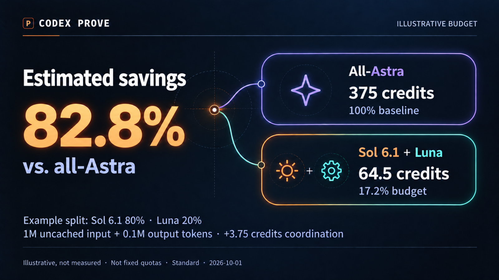
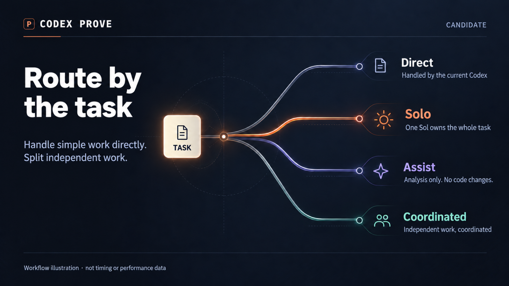
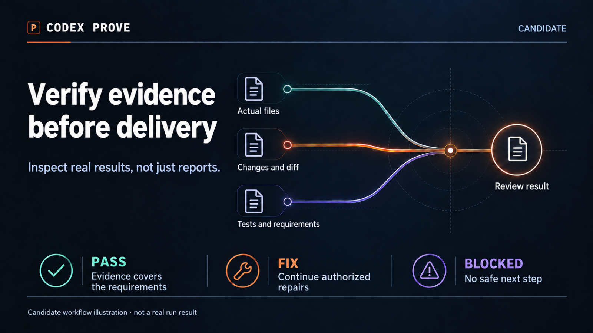
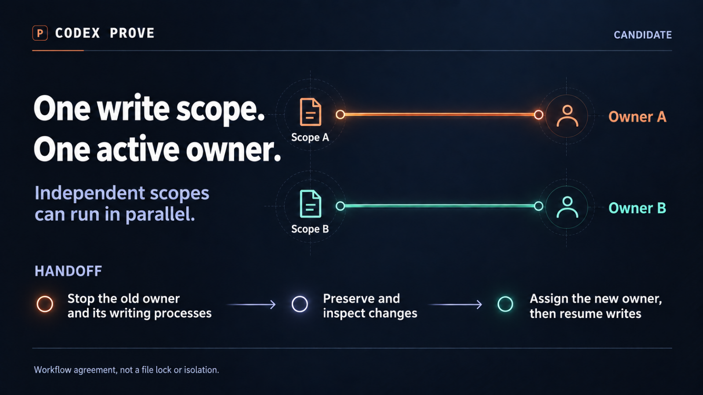

[简体中文](README.md) · [English](README.en.md)

> **v1.2.0 · Sol 6.1-first routing.** This page describes this source version. Publication status, tag and CI are recorded in the [GitHub Release](https://github.com/yehyakin/codex-prove/releases/tag/v1.2.0). See the [version notes](docs/release/v1.2.0.md); the [historical preparation record](docs/release/sol61-readiness.md) retains the scope of earlier candidate checks.

Illustrations retain their dated candidate labels, not the current publication status.

<p align="center">
  <a href="https://github.com/yehyakin/codex-prove/releases"></a>
  <a href="https://github.com/yehyakin/codex-prove/actions/workflows/posix-validation.yml"></a>
  <a href="https://github.com/yehyakin/codex-prove/actions/workflows/windows-validation.yml"></a>
  <a href="LICENSE"></a>
</p>

# Codex PROVE

**Let Sol finish the task. Bring in help when it helps.**

PROVE is a model-routing skill for Codex. **Sol 6.1 does the main work, Astra tackles hard questions, and Luna handles batches.** Keep a cohesive task in one context; split it only when separate work can make useful progress.

A copy change or small fix stays with your current Codex. A feature can span several files without needing a planning agent followed by an implementation agent. Describe the goal and boundaries; PROVE decides whether help is useful and checks the real result.

[Cost example](#cost-example) · [Routing](#how-work-is-routed) · [Install](#install) · [Usage](#usage) · [Before delivery](#before-delivery)

## Cost example

**One illustrative budget: 375 → 64.5 credits, or 82.8% less than all-Astra.** This calculation uses published rates and an assumed workload. It is not measured savings.



Using **2026-10-01 Codex Standard** rates, assume **1M uncached input + 0.1M output tokens (including billed reasoning)** in total. Split both input and output **Sol 80% / Luna 20%**. Model costs are 60.75 credits; adding 3.75 credits for coordination gives 64.5. That overhead is **5% of the all-Sol cost**, not 5% of all-Astra. The 80/20 split is not a routing quota.

This example excludes additional Astra consultation, tool fees, human effort, and elapsed time. It does not establish equal quality, a lower subscription price, or more weekly usage. Caching, context, review, and rework change real costs. See the [cost notes](docs/costs.md#english) for sources, formulas, and historical examples, or [view the animation](docs/assets/readme/livecanvas/cost-budget/cost-budget-en.gif).

## How work is routed

Start with the simplest useful route. No task has to use every model.



| Model | What it does | Default effort |
| --- | --- | --- |
| GPT-6.1 Sol | Complete tasks, routine development, and useful coordination and acceptance | high |
| GPT-6 Astra | One hard question or independent risk review; read-only | high |
| GPT-6 Luna | Mechanical batches with explicit rules and objective checks | max |

If your current Codex is already Sol 6.1, reuse it and its verified effort setting. A self-contained mechanical batch can go straight to Luna. Astra is not a mandatory approval stage.

| Task | Route |
| --- | --- |
| Small edit or clear question (Direct) | Your current Codex completes it, with zero agents |
| One cohesive feature or investigation (Solo) | Sol plans, implements, and checks it; no separate planner |
| Analysis or review only (Assist) | Sol analyzes; Astra handles a specific hard question or independent risk review; no implementation |
| Multiple independent workstreams (Coordinated) | Sol coordinates parallel work with explicit file ownership |

Less context transfer and fewer unnecessary agents are design goals, not measured savings percentages. A [single-task, three-arm A/B case](docs/research/2026-10-02-three-arm-results.md#english-summary) passed the same 19/19 independent checks in all arms, with no delegation. PROVE's API-equivalent estimate was 13.86% lower and elapsed time 10.20% shorter than ordinary Codex, but 0.61% higher and 9.36% longer than the host-customized da34 arm. **One trial per arm does not establish general savings or mixed-model routing benefits.** The budget above is not this case's measured result. [View the routing animation](docs/assets/readme/livecanvas/polish/routing-en.gif)

## Install

You need Git, Python 3.11+, and Codex with custom-agent support. The defaults use the three models above; a task needs only the models it actually invokes. Check account availability and supported effort settings before installation.

These commands fetch `main`. To pin v1.2.0, first confirm that its [Release](https://github.com/yehyakin/codex-prove/releases/tag/v1.2.0) is published, then run `git checkout v1.2.0` in the clone before validation and installation. A complete Git checkout is required; source archives without Git metadata are not supported direct-install inputs. The old [v1.1.0](https://github.com/yehyakin/codex-prove/releases/tag/v1.1.0) routing and runtime records do not validate this version.

### macOS / Linux

```sh
git clone https://github.com/yehyakin/codex-prove.git
cd codex-prove
bash scripts/validate.sh
bash scripts/install.sh
```

### Windows

Windows PowerShell 5.1:

```powershell
git clone https://github.com/yehyakin/codex-prove.git
Set-Location codex-prove
powershell.exe -NoProfile -ExecutionPolicy Bypass -File scripts/validate.ps1
powershell.exe -NoProfile -ExecutionPolicy Bypass -File scripts/install.ps1
```

For PowerShell 7, run these from the repository directory:

```powershell
pwsh -NoProfile -File scripts/validate.ps1
pwsh -NoProfile -File scripts/install.ps1
```

The installer backs up the previous version, leaves your existing `~/.codex/config.toml` alone, and doesn't touch unrelated agents. Open a new Codex session when it's done.

## Usage

Put `$codex-prove` before your task, then describe what you want as usual:

```text
$codex-prove Add an account settings page where users can change their name and avatar.
Use the existing login API and UI components. Leave payments alone and run the tests when done.
```

No form to fill out. No agent count to choose. Say what you want and what should stay untouched.

For that settings page, one Sol would normally inspect the API, edit the page, and run tests. Split off a module only when it can progress independently. Consult Astra about a concrete unresolved problem; use Luna when there is enough repetitive work to justify delegation.

If you only want to discuss a plan, say so:

```text
$codex-prove Look at this project's login setup and compare ways to improve it. Don't change any code yet.
```

**PROVE only runs when you ask for `$codex-prove`.** Use Codex normally the rest of the time. Even when you invoke PROVE, small tasks stay direct, without extra agents. It responds in Simplified Chinese by default; ask for English or another language if you prefer.

## Before delivery

**An agent saying “done” is not enough.** PROVE checks real files, runs verification, and checks requirement coverage. It continues work on failed checks, asking you when new permissions or important choices are needed. Acceptance depends on evidence, not a mandatory Astra sign-off.



[View the acceptance animation](docs/assets/readme/livecanvas/polish/evidence-en.gif)

<details>
<summary>How does parallel work avoid write conflicts?</summary>

Each write scope has one active owner. Before a handoff, stop the old agent and its mutating processes, inspect and preserve its changes, then let the new owner continue. Do not give the same scope to a new agent while the old one can still write.



These are workflow rules, not file locks or enforced isolation; they cannot prevent edits by an external editor or process. [View the handoff animation](docs/assets/readme/livecanvas/polish/ownership-en.gif) · [Full scheduling notes](.agents/skills/codex-prove/references/orchestration.md)

</details>

## What's new

This version reduces context handoffs and unnecessary role changes as a design goal.

- **Sol first.** Sol 6.1 takes routine execution and coordination; Terra leaves the defaults. The four stable role IDs remain, without requiring a four-agent team.
- **Keep cohesive work together.** Solo plans, implements, and checks its own task. Parallelize useful independent work only.
- **Consult Astra about a problem.** Use it for hard questions or necessary independent reviews, not routine sign-off.
- **Less setup chatter.** When the launch record identifies the model, work can start without a separate round of agents introducing themselves.
- **Keep moving when it's safe.** Local edits and tests you've already authorized don't stop for approval just because a test fails or a heading is missing. New permissions and important unresolved choices still need your input.
- **Less unnecessary code.** Borrowing from Ponytail, check what the project and standard library already offer before adding dependencies or abstractions.

See the [version notes](docs/release/v1.2.0.md), [release preparation checklist](docs/release/sol61-release-checklist.md) and [latest peer research](docs/research/2026-10-02-competitive-orchestration.md) for changes, evidence and gaps. The [historical preparation record](docs/release/sol61-readiness.md), [v1.1.0 release notes](docs/release/v1.1.0.md), and [historical compatibility matrix](docs/release/runtime-surface-matrix.md) retain their original scope; they do not automatically cover this version.

## A few common questions

**Are more agents always faster?**

No. Independent tasks can run in parallel, but splitting work, passing context, and waiting for results take time too. PROVE only launches agents when they help, within your Codex session's thread limit.

**Where did Terra go?**

Terra is no longer the default execution model. The `prove-complex-worker` role ID stays, now selecting Sol 6.1. Role names do not bind the project to a model. An explicitly requested model is never silently replaced.

**Can I change the models?**

Yes. The profiles are in [`.codex/agents/`](.codex/agents/prove-controller.toml). Sol and Astra default to `high`; Luna uses `max`. Validation checks TOML, model identifier syntax, and effort values without locking models to the defaults. It cannot prove account availability. Check that first, then validate, reinstall, and inspect the actual role mapping in a new session. See the [model configuration notes](.agents/skills/codex-prove/references/runtime-notes.md).

**Does the old Sol Control command still work?**

Yes, `$sol-control` remains an explicit compatibility alias. The project is now called Codex PROVE, so a model upgrade doesn't need another rename. [Rename notes](CODEX_PROVE_V1_IMPLEMENTATION_REPORT.md)

**Installed, but the skill is missing or a model won't launch?**

Start a new session, check that installation succeeded, and make sure the model is available in your Codex. Pulling source alone doesn't update the installed copy, and existing sessions don't reload profiles automatically. If it's still broken, open an [issue](https://github.com/yehyakin/codex-prove/issues/new/choose) with your OS, Codex version, and the error, with private information removed.

## Update or uninstall

Run `git status --short` first and keep any changes you've made. Once the working tree is clean:

```sh
git switch main
git pull --ff-only origin main
```

Run the validation and installation commands for your OS again, then open a new session. The installer prints the backup location. If it finds manually changed local files, it stops instead of overwriting them.

<details>
<summary>Uninstall, or restore the last backup</summary>

macOS / Linux:

```sh
bash scripts/uninstall.sh
# To restore the last backup instead:
bash scripts/uninstall.sh --restore-latest
```

Windows PowerShell 5.1:

```powershell
powershell.exe -NoProfile -ExecutionPolicy Bypass -File scripts/uninstall.ps1
# Restore the last backup:
powershell.exe -NoProfile -ExecutionPolicy Bypass -File scripts/uninstall.ps1 -RestoreLatest
```

PowerShell 7:

```powershell
pwsh -NoProfile -File scripts/uninstall.ps1
# Restore the last backup:
pwsh -NoProfile -File scripts/uninstall.ps1 -RestoreLatest
```

Only files installed by this project are removed. Other skills and agents stay in place.

</details>

## Feedback and contributions

Maintained by [@yehyakin](https://github.com/yehyakin). We support macOS, Linux, and Windows, covering current `main` and the latest release; see [SUPPORT.md](SUPPORT.md) for details. This is a community project, not an official OpenAI product.

Issues, PRs, and honest feedback are welcome. Read [CONTRIBUTING.md](CONTRIBUTING.md) and [CODE_OF_CONDUCT.md](CODE_OF_CONDUCT.md) before contributing. To see how it works internally, start with the [skill](.agents/skills/codex-prove/SKILL.md) and [scheduling notes](.agents/skills/codex-prove/references/orchestration.md).

For security issues, follow [SECURITY.md](SECURITY.md) and use [private vulnerability reporting](https://github.com/yehyakin/codex-prove/security/advisories/new). Keep tokens, private configuration, and private project code out of public issues.

## Inspiration and license

This project draws on [Ponytail](https://github.com/DietrichGebert/ponytail) for keeping implementations small, [Superpowers](https://github.com/obra/superpowers) for task splitting and review, and other community orchestration projects. Specific sources and attribution are in the [research notes](docs/research/2026-09-25-peer-orchestration.md) and [NOTICE](NOTICE).

Licensed under [Apache License 2.0](LICENSE).

**致谢 / Thanks**

Thank you to the [LINUX DO forum](https://linux.do/) community for its attention, feedback, and support.
