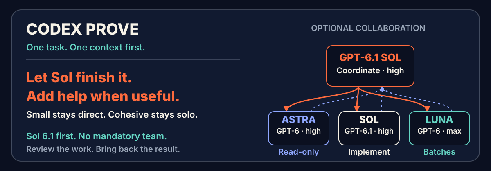
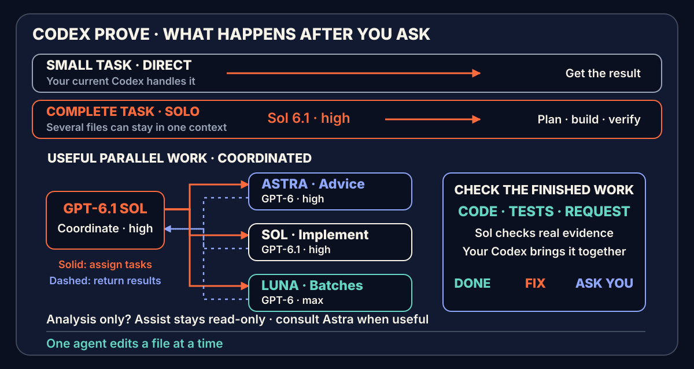

[简体中文](README.md) · [English](README.en.md)



<p align="center">
  <a href="https://github.com/yehyakin/codex-prove/releases"></a>
  <a href="https://github.com/yehyakin/codex-prove/actions/workflows/posix-validation.yml"></a>
  <a href="https://github.com/yehyakin/codex-prove/actions/workflows/windows-validation.yml"></a>
  <a href="LICENSE"></a>
</p>

# Codex PROVE

**Let Codex split the work. Stop using the most expensive model for everything.**

PROVE is a model-routing skill for Codex. The idea is simple: **Astra leads, Sol tackles hard problems, Terra handles everyday development, and Luna handles batches.** Astra plans, assigns work, and reviews the result. The other models do the work that fits them.

A copy change or a small fix stays with your current Codex. For cross-module work or a tricky investigation, bring in PROVE. You don't need to switch models yourself or brief every agent separately.

[Cost](#how-much-can-it-save) · [Install](#install) · [Usage](#usage) · [What's new](#whats-new)

## How much can it save?

**One budget example: $15.00 with Astra throughout, or $5.66 with work split across models. That's 62.3% less.**

| Approach | API token cost | Codex credits | Estimated saving |
| --- | ---: | ---: | ---: |
| Astra throughout | $15.00 | 375 | — |
| PROVE four-model split (including coordination) | $5.66 | 141.5 | **62.3%** |

The reason is straightforward. Planning and review need the lead model; writing tests, editing configuration, and repetitive changes don't always need the most expensive one.

| Model | What it does | Input / 1M tokens | Output / 1M tokens |
| --- | --- | ---: | ---: |
| GPT-6 Astra | Understand the task, plan, assign, and review | $10.00 | $50.00 |
| GPT-6 Sol | Hard problems, root-cause analysis, focused review | $2.00 | $10.00 |
| GPT-5.6 Terra | Everyday features, bug fixes, tests, and integration | $2.00 | $12.00 |
| GPT-6 Luna | Repetitive edits and information gathering with clear rules | $0.10 | $0.50 |

That example uses 1M input and 0.1M output tokens in total, with each token category split 20% / 20% / 40% / 20% across Astra / Sol / Terra / Luna. It adds 5% of the all-Astra cost for coordination, using the 2026-09-26 Standard short-context rates without caching.

It's a budget example, not a promise that every project saves 62.3%. It covers token cost, not your time or the wait. Poor task splitting and rework can make a run more expensive. See the [cost notes](docs/costs.md#english) for full prices, credits, and the older calculations.

## Install

You need Git, Python 3.11+, and a Codex setup that supports custom agents and the four models above.

### macOS / Linux

```sh
git clone https://github.com/yehyakin/codex-prove.git
cd codex-prove
bash scripts/validate.sh
bash scripts/install.sh
```

### Windows

Windows PowerShell 5.1:

```powershell
git clone https://github.com/yehyakin/codex-prove.git
Set-Location codex-prove
powershell.exe -NoProfile -ExecutionPolicy Bypass -File scripts/validate.ps1
powershell.exe -NoProfile -ExecutionPolicy Bypass -File scripts/install.ps1
```

For PowerShell 7, run these from the repository directory:

```powershell
pwsh -NoProfile -File scripts/validate.ps1
pwsh -NoProfile -File scripts/install.ps1
```

The installer backs up the previous version, leaves your existing `~/.codex/config.toml` alone, and doesn't touch unrelated agents. Open a new Codex session when it's done.

These commands install current `main`, which includes the GPT-6 model split. The latest release tag is still [v1.0.0](https://github.com/yehyakin/codex-prove/releases/tag/v1.0.0), with the older model setup.

## Usage

Put `$codex-prove` before your task, then describe what you want as usual:

```text
$codex-prove Add an account settings page where users can change their name and avatar.
Use the existing login API and UI components. Leave payments alone and run the tests when done.
```

No form to fill out. No agent count to choose. Say what you want and what should stay untouched.



For that settings page, Astra would first look at the existing API and UI, then decide how to split the work. Terra could handle the routine page and API changes; Sol would join if there's a hard problem; Luna would handle repetitive edits if there are enough to justify it. Models that aren't needed stay out.

Independent work can run in parallel. Work that needs an earlier result waits its turn. Two agents don't edit the same file at once. Astra checks the code and tests against your request, and your current Codex brings the result back to you.

If you only want to discuss a plan, say so:

```text
$codex-prove Look at this project's login setup and compare ways to improve it. Don't change any code yet.
```

**PROVE only runs when you ask for `$codex-prove`.** Use Codex normally the rest of the time. Even when you invoke PROVE, small tasks stay direct, without extra agents. It responds in Simplified Chinese by default; ask for English or another language if you prefer.

## What's new

People told us the old workflow took too much upkeep, got `blocked` too often, and kept asking for approval. This update focuses on that.

- **Updated model split.** Astra leads, Sol handles specialist work, Terra handles routine work, and Luna handles batches. A task doesn't have to use all four.
- **Less setup chatter.** When the launch record identifies the model, work can start without a separate round of agents introducing themselves.
- **Keep moving when it's safe.** Local edits and tests you've already authorized don't stop for approval just because a test fails or a heading is missing. New permissions and important unresolved choices still need your input.
- **Less unnecessary code.** Borrowing from Ponytail, check what the project and standard library already offer before adding dependencies or abstractions.

These changes are on `main`; there is no stable v1.1 tag yet. See the [upgrade notes](docs/release/v1.1-gpt6-audit.md) for details and the [compatibility and test notes](docs/release/runtime-surface-matrix.md) for what's been tried on each setup. Full end-to-end testing of the current four-model setup is still in progress.

## A few common questions

**Are more agents always faster?**

No. Independent tasks can run in parallel, but splitting work, passing context, and waiting for results take time too. PROVE only launches agents when they help, within your Codex session's thread limit.

**Why keep Terra?**

The current split gives Sol specialist work and Terra routine work. At the prices above, their input costs the same, and Sol's output is cheaper. So the reason isn't that Terra always costs less. Future changes should follow how the models perform on actual tasks, not just their names or prices.

**Can I change the models?**

Yes. The profiles are in [`.codex/agents/`](.codex/agents/prove-controller.toml). Astra, Sol, and Terra default to `high`; Luna uses `max`. Make sure your Codex can use the model and reasoning level, then validate, reinstall, and open a new session. See the [model configuration notes](.agents/skills/codex-prove/references/runtime-notes.md).

**Does the old Sol Control command still work?**

Yes, `$sol-control` remains an explicit compatibility alias. The project is now called Codex PROVE, so a model upgrade doesn't need another rename. [Rename notes](CODEX_PROVE_V1_IMPLEMENTATION_REPORT.md)

**Installed, but the skill is missing or a model won't launch?**

Start a new session, check that installation succeeded, and make sure the model is available in your Codex. Pulling source alone doesn't update the installed copy, and existing sessions don't reload profiles automatically. If it's still broken, open an [issue](https://github.com/yehyakin/codex-prove/issues/new/choose) with your OS, Codex version, and the error, with private information removed.

## Update or uninstall

Run `git status --short` first and keep any changes you've made. Once the working tree is clean:

```sh
git switch main
git pull --ff-only origin main
```

Run the validation and installation commands for your OS again, then open a new session. The installer prints the backup location. If it finds manually changed local files, it stops instead of overwriting them.

<details>
<summary>Uninstall, or restore the last backup</summary>

macOS / Linux:

```sh
bash scripts/uninstall.sh
# To restore the last backup instead:
bash scripts/uninstall.sh --restore-latest
```

Windows PowerShell 5.1:

```powershell
powershell.exe -NoProfile -ExecutionPolicy Bypass -File scripts/uninstall.ps1
# Restore the last backup:
powershell.exe -NoProfile -ExecutionPolicy Bypass -File scripts/uninstall.ps1 -RestoreLatest
```

PowerShell 7:

```powershell
pwsh -NoProfile -File scripts/uninstall.ps1
# Restore the last backup:
pwsh -NoProfile -File scripts/uninstall.ps1 -RestoreLatest
```

Only files installed by this project are removed. Other skills and agents stay in place.

</details>

## Feedback and contributions

Maintained by [@yehyakin](https://github.com/yehyakin). We support macOS, Linux, and Windows, covering current `main` and the latest release; see [SUPPORT.md](SUPPORT.md) for details. This is a community project, not an official OpenAI product.

Issues, PRs, and honest feedback are welcome. Read [CONTRIBUTING.md](CONTRIBUTING.md) and [CODE_OF_CONDUCT.md](CODE_OF_CONDUCT.md) before contributing. To see how it works internally, start with the [skill](.agents/skills/codex-prove/SKILL.md) and [scheduling notes](.agents/skills/codex-prove/references/orchestration.md).

For security issues, follow [SECURITY.md](SECURITY.md) and use [private vulnerability reporting](https://github.com/yehyakin/codex-prove/security/advisories/new). Keep tokens, private configuration, and private project code out of public issues.

## Inspiration and license

This project draws on [Ponytail](https://github.com/DietrichGebert/ponytail) for keeping implementations small, [Superpowers](https://github.com/obra/superpowers) for task splitting and review, and other community orchestration projects. Specific sources and attribution are in the [research notes](docs/research/2026-09-25-peer-orchestration.md) and [NOTICE](NOTICE).

Licensed under [Apache License 2.0](LICENSE).

**致谢 / Thanks**

Thank you to the [LINUX DO forum](https://linux.do/) community for its attention, feedback, and support.
