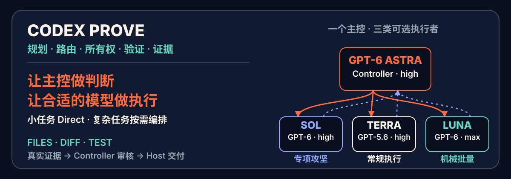
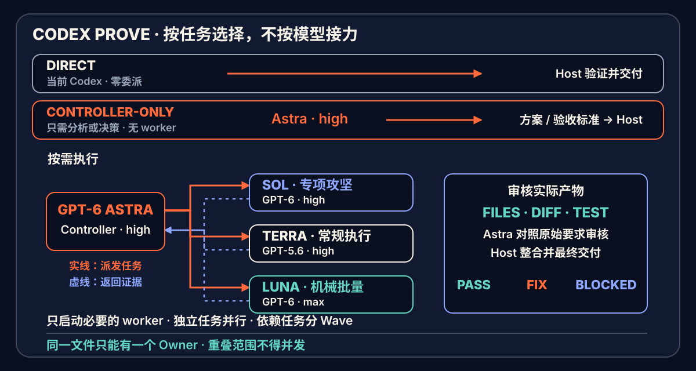

[简体中文](README.md) · [English](README.en.md)



<p align="center">
  <a href="https://github.com/yehyakin/codex-prove/releases/tag/v1.0.0"></a>
  <a href="https://github.com/yehyakin/codex-prove/actions/workflows/posix-validation.yml"></a>
  <a href="https://github.com/yehyakin/codex-prove/actions/workflows/windows-validation.yml"></a>
  <a href="LICENSE"></a>
  <a href="https://github.com/yehyakin/codex-prove/stargazers"></a>
</p>

# Codex PROVE

**规划任务，路由模型，用证据完成交付。**

`codex-prove` 是一个显式调用、模型中立的 Codex 编排 Skill：**一个 Controller 做判断和终审，按需选择 worker 做有界执行。**

[60 秒开始](#60-秒开始) · [路由方式](#工作方式) · [成本模型](#为什么能节省成本) · [运行证据](#当前状态) · [安装维护](#安装检查与卸载)

你只需要给出目标、完成条件和限制；PROVE 会自动完成规划、能力路由、文件 ownership、分阶段执行、验证和证据审核。

- **Controller** 是唯一主控：理解目标、规划、路由、分配 ownership、调度并完成最终审核。
- **Specialist worker** 处理困难但可独立验收的实现、根因分析或专项只读审核。
- **Regular worker（Complex worker profile）** 处理方案明确的常规功能、修复、测试与集成。
- **Efficient worker** 承接规则明确、可客观验证的机械批量执行；单行小改不必委派。

简单任务仍由当前 Codex 直接完成。复杂、跨模块、可并行或高风险任务，再显式调用 `$codex-prove`。

运行时默认使用简体中文；如果用户明确指定其他语言，则遵循用户选择。

> **上一稳定版 v1.0.0 的记录：**115 项测试、39 个 Forward 场景、POSIX 与 Windows PowerShell 5.1/7 CI，以及全新会话 Compatibility 真实路由。

规范仓库：[yehyakin/codex-prove](https://github.com/yehyakin/codex-prove)。这是独立社区项目，不代表 OpenAI 官方产品或背书。

## v1.1 开发版：更强主控，更少流程

**Astra 统筹，Sol 攻坚，Terra 主力，Luna 批量；小任务直接做。**
主控为 GPT-6 Astra / high；按需选择 GPT-6 Sol / high、GPT-5.6 Terra / high 或 GPT-6 Luna / max 执行，
不要求四个模型全部参与，也不按模型等级逐层接力。

- 小任务即使显式调用，也保持 **Direct、零委派**。
- 有权威模型选择记录即可直接派发完整任务，不再空跑一轮“自证握手”。
- 已授权的本地实现、测试和修正连续执行；缺少标题或一次测试失败不再机械 `BLOCKED`。
- 同一范围只允许一个活跃写入者；停稳旧执行者及其进程、保留 Diff 后可以安全移交。
- 融入 **Ponytail** 的最小实现思想：先复用现有代码、标准库和平台能力，不增加常驻 Hook、模式开关或审批。

本节描述开发分支，不是已发布版本。审计、测试和运行边界见 [v1.1 升级记录](docs/release/v1.1-gpt6-audit.md)。

9 月 26 日确认本候选的默认分工：**Astra 主控、Sol 专项、Terra 常规、Luna 批处理**。
Sol、Luna 升级代际，保留既有 effort、权限和角色标识；Terra 继续常规执行，
不因新模型发布而自动替换。Jev 仅用于研发调研，不接入默认路由，也不成为安装或运行依赖。

## 核心路由与预计节省

> **历史口径：**下表和下方完整计算保留 v1.0 的 Sol 主控及 **2026-08-04** 费率快照；不适用于 v1.1 Astra 主控。新配置尚无匹配成本测量，不能沿用这些百分比，也不能叠加 Ponytail 的上游节省数据。


下表以“同一任务全部使用 Sol”为 `1.00×` 基线。三个模型的 token 份额合计为 100%，`编排开销`表示额外的 Sol 规划、审核、协调和必要返工，相对于全 Sol 基线增加的成本。

| 场景 | 示例 token 路由 | 编排开销 | 预计节省 |
| --- | --- | ---: | ---: |
| **普通明确型项目** | Sol 10% · Terra 20% · Luna 70% | 3%–7% | **72.2%–76.2%** |
| **混合型项目** | Sol 20% · Terra 40% · Luna 40% | 2%–12% | **50.4%–60.4%** |
| **复杂型项目** | Sol 25% · Terra 60% · Luna 15% | 7%–17% | **33.4%–43.4%** |
| **Direct 小任务** | 当前 Codex 直接完成，不委派 | 0% | **路由节省 0%** |

这些区间是基于公开费率和示例 token 份额的 `scenario_model_projection`，用于预算规划，**不是每个任务的保证，也不代表一定更快**。

## 60 秒开始

### macOS / Linux

```sh
git clone https://github.com/yehyakin/codex-prove.git
cd codex-prove

bash scripts/validate.sh
bash scripts/install.sh
```

### Windows

Windows PowerShell 5.1：

```powershell
git clone https://github.com/yehyakin/codex-prove.git
Set-Location codex-prove

powershell.exe -NoProfile -ExecutionPolicy Bypass -File scripts/validate.ps1
powershell.exe -NoProfile -ExecutionPolicy Bypass -File scripts/install.ps1
```

PowerShell 7：

```powershell
pwsh -NoProfile -File scripts/validate.ps1
pwsh -NoProfile -File scripts/install.ps1
```

安装后打开一个新的 Codex 会话：

```text
$codex-prove

目标：为现有项目增加账号设置功能。
完成条件：用户可以修改昵称和头像；现有认证 API 保持兼容；测试和构建通过。
限制：不修改支付模块，不更换现有 UI 框架。
```

也可以直接写：

```text
$codex-prove 重构认证模块，保持现有 API 兼容，测试和构建必须通过。
```

不需要指定 worker 数量或模型。Controller 会根据任务能力需求形成最小可执行图。

## 先判断是否值得编排

| 直接交给当前 Codex | 显式使用 `$codex-prove` |
| --- | --- |
| 单文件、小改动、已定位的问题 | 多模块、强依赖、共享接口或高后果修改 |
| 简单回答、确定性命令、短文本 | 需要拆分、并行、ownership 或独立证据审核 |
| 编排成本高于实现成本 | 返工代价明显高于规划和审核开销 |

PROVE 不是默认模式，也不是固定 Agent 团队。它只在编排能提高交付质量或降低总成本时使用 worker。

## 为什么能节省成本

Codex PROVE 的节省逻辑很直接：

> **把高成本的目标理解、边界判断与最终审核留给 Sol；把实际执行按复杂度路由给 Terra 或 Luna。**

按 **2026-08-04** 的官方 API 价格与 Codex token-based rate card，同一种 token 类型下，三个模型的相对成本为：

| 模型 | 相对成本 | 在本项目中的职责 |
| --- | ---: | --- |
| **Sol** | **1.00×** | 理解、规划、分配、调度、最终审核 |
| **Terra High** | **0.40×** | 复杂、跨模块、长上下文或高风险执行 |
| **Luna Max** | **0.04×** | 清晰、低歧义、高吞吐执行 |

也就是说，在相同 token 类型下：

- Terra 的成本约为 Sol 的 **40%**；
- Luna 的成本约为 Sol 的 **4%**；
- Luna 不是 Sol 的替代品，而是把大量明确执行从 Sol 上移走，从而保留 Sol 的判断与审核能力。

这些数字属于 `scenario_model_projection`：它们用于预算规划，**不是匹配 A/B 实验、不是每个任务的保证，也不代表一定更快**。上下文重复、错误拆分、并行等待、输出量、Fast mode 和返工都可能降低甚至反转节省。

在这一历史假设下，预算示例是：

> **普通明确型项目可投影节省约 72%–76%，典型混合项目约 50%–60%，复杂项目约 33%–43%；实际结果必须按真实路由和 token 使用复算。**

而不是把所有任务概括成一个固定的“平均节省 56%”。

<details>
<summary><strong>查看官方费率、公式与完整计算</strong></summary>

### API 价格

每 1M tokens：

| Model | Input | Cached input | Output |
| --- | ---: | ---: | ---: |
| GPT-5.6 Sol | $5.00 | $0.50 | $30.00 |
| GPT-5.6 Terra | $2.00 | $0.20 | $12.00 |
| GPT-5.6 Luna | $0.20 | $0.02 | $1.20 |

### Codex token-based credits

每 1M tokens：

| Model | Input | Cached input | Output |
| --- | ---: | ---: | ---: |
| GPT-5.6 Sol | 125 credits | 12.5 credits | 750 credits |
| GPT-5.6 Terra | 50 credits | 5 credits | 300 credits |
| GPT-5.6 Luna | 5 credits | 0.5 credits | 30 credits |

当时两套口径的相对比例相同：

```text
Sol = 1.00
Terra = 0.40
Luna = 0.04
```

因此可以使用同一条相对成本公式：

```text
route_cost =
  sol_share × 1.00
  + terra_share × 0.40
  + luna_share × 0.04
  + orchestration_overhead

saving = 1 - route_cost
```

普通明确型项目示例：

```text
route_cost
= 0.10 × 1.00
+ 0.20 × 0.40
+ 0.70 × 0.04
+ 0.03–0.07
= 0.238–0.278

saving
= 1 - 0.238–0.278
= 72.2%–76.2%
```

API 用户看到的是美元金额；ChatGPT / Codex 用户通常看到的是 credits 或订阅容量。两者是不同计费单位，不能把 API 美元节省直接描述成订阅账单节省。

官方来源：

- [OpenAI model comparison](https://developers.openai.com/api/docs/models/compare)
- [OpenAI Codex rate card](https://help.openai.com/en/articles/20001106-codex-rate-card)

少量仍使用 legacy rate card 的 Enterprise 工作区，应以其实际适用费率为准。

</details>

## 它解决什么问题

| 常见问题 | Codex PROVE 的处理方式 |
| --- | --- |
| 同一个 Agent 同时规划、实现和验证，容易顾此失彼 | Controller 专注判断与审核，worker 专注有界执行 |
| 所有工作都使用最高成本模型 | 按不确定性和验收方式选择 specialist、regular 或 efficient worker |
| 多个执行者同时修改共享文件 | **一个文件，一个 owner**；重叠范围必须串行 |
| “完成”只有口头总结，没有真实证据 | 必须返回 changed paths、diff、测试、构建或产物 |
| 错误任务被无限重试 | 有新证据才继续；连续无进展或触及真实边界时停止该路径 |

它的目标不是制造一个热闹的多 Agent 团队，而是为复杂任务建立一个清晰、可审核的控制面。

## 工作方式



上图保留 v1.0 的两类 worker 示意；v1.1 增加独立 specialist，当前路径如下。

```text
用户目标
   │
   ▼
Host：轻量路由
   ├─ Direct：简单任务由当前 Codex 直接完成
   └─ 复杂任务 → Controller：理解 → 规划 → 分配 → 调度
                     ├─ Controller-only：计划、分析或审核
                     ├─ Specialist worker：困难但独立的执行 / 审核
                     ├─ Regular worker（Complex worker profile）：常规实现 / 测试
                     └─ Efficient worker：机械批量执行
   │
   ▼
真实文件 + Diff + 测试 / 构建 / 产物证据
   │
   ▼
复杂任务由 Controller 按 REQ-ID 审核 → PASS / FIX / BLOCKED → Host 交付
```

<details>
<summary><strong>角色、并行与恢复规则</strong></summary>

### 当前默认配置

| 角色 | 配置 | 边界 |
| --- | --- | --- |
| Controller | `prove-controller` → `gpt-6-astra` / `high` / `read-only` | 一个主控，负责规划、分配和终审 |
| Specialist worker | `prove-specialist-worker` → `gpt-6-sol` / `high` / `workspace-write` | 困难但能独立验收的执行或专项只读审核，不是第二主控 |
| Regular worker | `prove-complex-worker` → `gpt-5.6-terra` / `high` / `workspace-write` | 常规功能、修复、测试与集成；保留既有标识以兼容安装 |
| Efficient worker | `prove-efficient-worker` → `gpt-6-luna` / `max` / `workspace-write` | 规则明确、客观可验证的机械批量执行 |

最难且不可拆分的全局决策仍由 Astra 处理。所有 worker 禁止再创建子代理；
只读任务的写入范围为空，即使技术权限允许写入也不得修改。

v1.0 的主控为 `gpt-5.6-sol`。角色名不随模型代际改变；模型升级还需同步验证，不是改一个名字就算成功。

### 必须保留的边界

1. **一个活跃 owner。** 独立且无重叠的任务可以并行；共享配置、文件和副作用必须串行或分 Wave。并发量取决于实时容量。
2. **允许安全交接。** 旧 worker 及其写入进程停止后，Host 检查并保留已有 Diff、用户修改和尝试记录，再指定新 owner。超时不代表已经停止。
3. **真实证据。** 主控检查原始要求、实际文件、Diff、验证输出和覆盖情况；worker 的 `PASS` 或 transport 的 `completed` 不等于交付通过。
4. **按影响验证。** 后续改动只使受影响的证据失效；沿用无变化候选上的新鲜证据。文案改动不全量构建，迁移不只做存在性检查。
5. **按进展修正。** `FIX` 表示继续已授权的窄范围修复；连续两次无进展后停止该路径并重新判断，不通过换 Agent 重置历史。
6. **真实阻塞才询问。** 新权限、重大未决选择或无安全下一步时才 `BLOCKED`；模型不可选仍必须如实报告，不静默替换。
7. **精简不减功能。** Ponytail 思想用于复用和避免过度实现，不删除必要验证、错误处理、无障碍能力或用户明确要求。
8. **不冒充隔离。** 工作区前后快照只能说明净变化，不能证明期间从未写入。高风险操作仍需要授权和实际可执行的权限边界。

Native Nested 可用且经过真实调用验证时，主控直接调度 worker；否则由 Host 按同一计划派发，再交回主控审核，即 Compatibility。无需为了缺少嵌套能力反复请求批准。

| 裁决 | 含义 |
| --- | --- |
| `PASS` | 全部要求由当前候选的真实证据支持 |
| `FIX` | 存在可在授权范围内继续解决的问题 |
| `BLOCKED` | 确实没有安全、授权内的下一步，并给出具体原因 |

详细协议只维护在 [orchestration.md](.agents/skills/codex-prove/references/orchestration.md) 和按需读取的 [runtime-notes.md](.agents/skills/codex-prove/references/runtime-notes.md)。

</details>

## 什么时候不该使用

以下情况通常直接交给当前 Codex 更合适：

- 修改一个明确的小函数；
- 修复已定位的拼写、文案或样式；
- 只需要解释代码、回答问题或生成短文本；
- 无法划分独立 write scope；
- 编排、重复上下文与审核成本明显高于实现本身。

`$codex-prove` 不是默认模式。**小任务保持 Direct，复杂任务才进入编排。**

## 安装、检查与卸载

### macOS / Linux

```sh
bash scripts/validate.sh
bash scripts/install.sh --check
bash scripts/install.sh

bash scripts/uninstall.sh
bash scripts/uninstall.sh --restore-latest
```

### Windows

```powershell
# Windows PowerShell 5.1
powershell.exe -NoProfile -ExecutionPolicy Bypass -File scripts/validate.ps1
powershell.exe -NoProfile -ExecutionPolicy Bypass -File scripts/install.ps1
powershell.exe -NoProfile -ExecutionPolicy Bypass -File scripts/uninstall.ps1
powershell.exe -NoProfile -ExecutionPolicy Bypass -File scripts/uninstall.ps1 -RestoreLatest

# PowerShell 7
pwsh -NoProfile -File scripts/validate.ps1
pwsh -NoProfile -File scripts/install.ps1
pwsh -NoProfile -File scripts/uninstall.ps1
pwsh -NoProfile -File scripts/uninstall.ps1 -RestoreLatest
```

安装器只管理本项目拥有的 Skill 与 agent 文件，并保留无关 agent 和用户自己的 `~/.codex/config.toml`。隔离生命周期测试时可使用 `ORCHESTRATE_HOME` 指定临时 home。

安装器支持从 v0.1–v0.5 的受管版本迁移：先校验旧 Skill、Agent 与 ownership state，再备份并原子安装到 `~/.agents/skills/codex-prove` 和 `~/.codex/codex-prove`。v1.0 同时安装 `$sol-control` 兼容入口。`--restore-latest` 可恢复升级前的完整可管理状态；检测到用户修改、无 ownership 的同名目标或校验失败时会停止，不会覆盖。

平台与证据覆盖详见 [`docs/release/runtime-surface-matrix.md`](docs/release/runtime-surface-matrix.md)。

## 当前状态

上一稳定版本为 **[v1.0.0](https://github.com/yehyakin/codex-prove/releases/tag/v1.0.0)**。

> **迁移说明：**Sol Control 已更名为 Codex PROVE。新入口是 `$codex-prove`；`$sol-control` 在 v1.0 中保留为显式兼容别名。安装器可事务迁移受管的 v0.1–v0.5 版本，`--restore-latest` 可恢复升级前状态。

以下表格是 v1.0 历史证据，不是 v1.1 的测试报告。

| 验证面 | 已记录证据 |
| --- | --- |
| 本地仓库 | v1.0.0 的 Skill Creator 双入口、静态验证、POSIX 生命周期与 115 项测试均通过；39 个 Forward 场景覆盖路由、所有权、证据与失败门禁 |
| 匹配 smoke | v0.5.0 的一组真实匹配 smoke 已记录；v1.0 只重构品牌、角色名与安装迁移，不把旧 smoke 冒充为新角色运行证明 |
| 托管 CI | [POSIX 工作流](https://github.com/yehyakin/codex-prove/actions/workflows/posix-validation.yml)：Ubuntu/macOS × Python 3.11/3.13；[Windows 工作流](https://github.com/yehyakin/codex-prove/actions/workflows/windows-validation.yml)：Windows Server 2022 / `windows-latest` × Windows PowerShell 5.1 / PowerShell 7 |
| Windows 实机安装 | 用户报告安装成功；未收集 Windows 版本、安装日志或运行时身份载荷，因此不扩展为 Native Nested 证明 |
| v1.0 运行证据 | 全新会话已发现 `$codex-prove` 与 `$sol-control` 兼容入口；`prove-controller`、`prove-complex-worker`、`prove-efficient-worker` 的 Host/tool 映射和两回合握手均通过 |
| 运行表面 | Compatibility 已以新角色名完成 Controller 规划、Host 分派和同一 Controller 终审；Native Nested 与物理 Windows 11 运行时仍单独标注为未验证 |

v1.0.0 将品牌、Skill 与 Agent 角色从具体模型名解耦，同时保留 Requirement ID、产物优先审核、验证者校验、有限只读挑战与恢复包；完整设计与证据见 [v1.0.0 实施报告](CODEX_PROVE_V1_IMPLEMENTATION_REPORT.md)。早期模型品牌版本保留在[历史实施报告](SOL_CONTROL_IMPLEMENTATION_REPORT.md)。

这些状态描述的是已记录证据范围，不推断未验证运行表面。

## 仓库结构

```text
.agents/skills/
├─ codex-prove/                规范 Skill 与调用入口
│  ├─ SKILL.md
│  └─ references/
│     ├─ orchestration.md      编排契约
│     ├─ runtime-notes.md      运行时与能力 profile
│     └─ ponytail-license.txt  上游 MIT 归属
└─ sol-control/                v1.0 显式兼容入口

.codex/agents/
├─ prove-controller.toml
├─ prove-specialist-worker.toml
├─ prove-complex-worker.toml
└─ prove-efficient-worker.toml

scripts/
├─ validate.*
├─ install.*
├─ uninstall.*
└─ test.sh

tests/                         contract、生命周期与 forward-case 测试
docs/                          发布证据、设计记录与 README 资源
README.md                      简体中文
README.en.md                   English
```

## 文档入口

- [Public Skill](.agents/skills/codex-prove/SKILL.md)
- [编排契约](.agents/skills/codex-prove/references/orchestration.md)
- [运行时与能力 profile](.agents/skills/codex-prove/references/runtime-notes.md)
- [Controller 配置](.codex/agents/prove-controller.toml)
- [Specialist worker 配置](.codex/agents/prove-specialist-worker.toml)
- [Complex worker 配置](.codex/agents/prove-complex-worker.toml)
- [Efficient worker 配置](.codex/agents/prove-efficient-worker.toml)
- [运行表面矩阵](docs/release/runtime-surface-matrix.md)
- [真实项目路由样本](tests/real-project-benchmark.md)
- [v1.0 匹配 A/B 协议](tests/v100-ab-benchmark.md)
- [v1.0 真实匹配 smoke 证据](tests/v100-live-smoke.md)
- [v1.0 证据优先实现报告](CODEX_PROVE_V1_IMPLEMENTATION_REPORT.md)
- [v0.4.0 实施报告](SOL_CONTROL_IMPLEMENTATION_REPORT.md)

## 维护与支持

主要维护者：[@yehyakin](https://github.com/yehyakin)。项目支持最新发布版本与当前 `main`；具体环境边界和求助渠道见 [SUPPORT.md](SUPPORT.md)。提交改进前请阅读 [CONTRIBUTING.md](CONTRIBUTING.md) 和 [CODE_OF_CONDUCT.md](CODE_OF_CONDUCT.md)，可复现问题请使用仓库的结构化 [Issue 模板](https://github.com/yehyakin/codex-prove/issues/new/choose)。

## 安全

安全问题不要提交公开 Issue，也不要附带 Token、私有路径或私有仓库内容。请阅读 [SECURITY.md](SECURITY.md)，并通过 GitHub [私密漏洞报告](https://github.com/yehyakin/codex-prove/security/advisories/new)提交。

## 开发与测试

需要 Python 3.11 或更高版本。

```sh
bash scripts/validate.sh
bash scripts/test.sh
python3 scripts/benchmark_ab.py validate tests/fixtures/v100-ab-benchmark.json
```

`scripts/test.sh` 会选择可用的 Python 3.11+，并运行完整 `unittest` 测试集。
`benchmark_ab.py` 只冻结实验、生成交叉顺序并汇总完整结果；它不会调用模型，也不会在没有实测 cell 时宣布赢家。

修改 README 时应同步更新双语版本与文档测试。测试应保护事实、链接、费率快照、公式、安全边界和平台命令，不应把某一种营销文案或首页章节顺序永久锁死。

## 限制

- 成本区间是基于公开费率与示例 token 份额的预算投影，不是匹配 A/B benchmark。
- 真实 token 总量可能因规划、上下文重复、验证和返工而变化。
- Fast mode、超长上下文和不同输出比例可能改变实际消耗。
- 精确 custom agent、model、reasoning effort 与权限选择取决于宿主运行表面。
- 并行能力取决于实时容量和互不重叠的 write scope，不承诺固定 worker 数量。
- GitHub 托管 Windows runner 证明的是 Windows Server 行为，不等同于物理 Windows 11。
- Specialist 和 regular worker 都是执行层，不是第二 planner 或 controller。
- PROVE 表示受证据约束的验证流程，不保证绝对正确。
- 最终交付依赖真实文件、完整 diff 与新鲜验证；配置标签本身不是运行证据。

## Inspirations / Prior Art

- [Eric Provencher：Rethinking skills and prompts for GPT-6 Astra](https://x.com/pvncher/status/2095991462416490862)：缩短常驻指令、按需读取参考、避免流程压过用户目标。
- [DietrichGebert/ponytail](https://github.com/DietrichGebert/ponytail)：理解后再精简，复用现有能力，避免过度实现；保留 MIT 归属，不引入其常驻插件或上游成绩。
- [近期同类实现复核](docs/research/2026-09-25-peer-orchestration.md)：对照 da34、joserey7、Sol Advisor、Superpowers 等项目的实际规则和验证机制，吸收避免重复劳动、按风险审核与评测校准，不引入固定团队。
- 更早的编排与证据工作流来源见 [NOTICE](NOTICE)。借鉴思想与实质改写分别记录。

## 许可证

本仓库采用 [Apache License 2.0](LICENSE)。相关先例与归属记录见 [NOTICE](NOTICE)。

**致谢 / Thanks**

感谢 [LINUX DO 论坛](https://linux.do/) 社区的关注、反馈与支持
