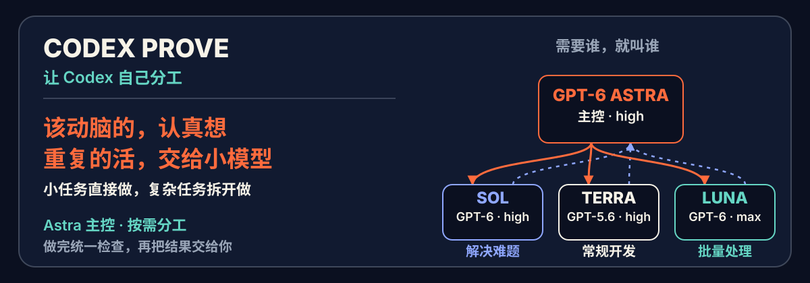
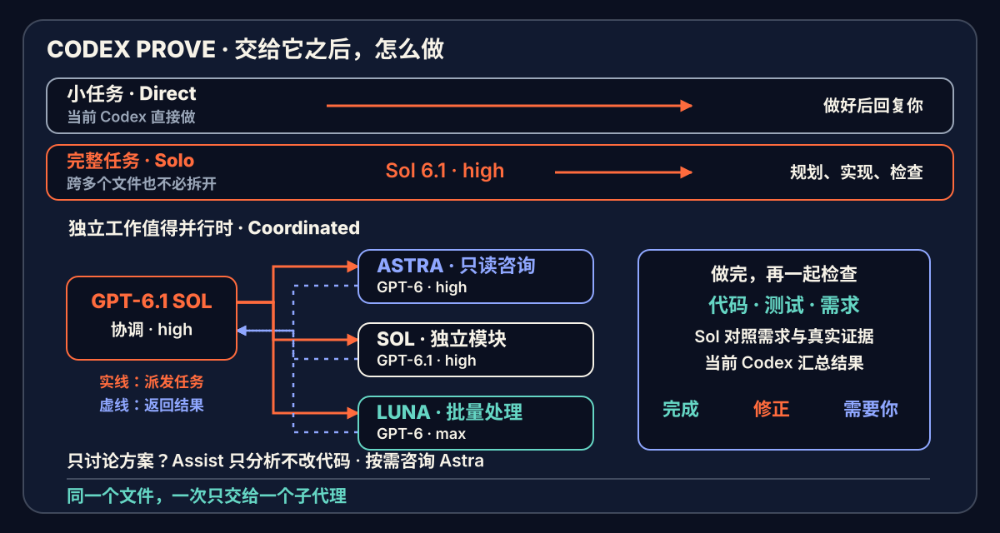

[简体中文](README.md) · [English](README.en.md)



<p align="center">
  <a href="https://github.com/yehyakin/codex-prove/releases"></a>
  <a href="https://github.com/yehyakin/codex-prove/actions/workflows/posix-validation.yml"></a>
  <a href="https://github.com/yehyakin/codex-prove/actions/workflows/windows-validation.yml"></a>
  <a href="LICENSE"></a>
</p>

# Codex PROVE

**让 Codex 自己分工，别什么活都用最贵的模型。**

PROVE 是一个给 Codex 用的模型分工 Skill。核心很简单：**Astra 主控、Sol 专项、Terra 常规、Luna 批处理。** 主控负责理解、拆分、分配和审核，具体执行交给合适的子代理。

改个文案、修个小问题，当前 Codex 直接做。遇到跨模块开发、复杂排查，再让它拆开做。你不用自己切模型，也不用挨个给子代理派活。

[能省多少](#能省多少) · [安装](#安装) · [怎么用](#怎么用) · [这次更新](#这次更新了什么)

## 能省多少

**一个预算例子：全程 Astra 约 $15.00，按任务分工后约 $5.66，省 62.3%。**

| 执行方式 | API token 费用 | Codex credits | 预计节省 |
| --- | ---: | ---: | ---: |
| 全程 Astra | $15.00 | 375 | — |
| PROVE 四模型分工（含编排开销） | $5.66 | 141.5 | **62.3%** |

原因很直接：规划和审核需要主控，但写测试、改配置、批量处理，不一定都需要最贵的模型。

| 模型 | 负责什么 | 输入 / 1M tokens | 输出 / 1M tokens |
| --- | --- | ---: | ---: |
| GPT-6 Astra | 理解需求、拆分任务、分配和审核 | $10.00 | $50.00 |
| GPT-6 Sol | 难题攻坚、根因分析、专项检查 | $2.00 | $10.00 |
| GPT-5.6 Terra | 常规功能、修 Bug、测试和集成 | $2.00 | $12.00 |
| GPT-6 Luna | 按明确规则做批量修改、整理资料 | $0.10 | $0.50 |

上面的例子按累计 1M 输入、0.1M 输出计算，每类 token 分给 Astra / Sol / Terra / Luna 的比例是 20% / 20% / 40% / 20%，再加全 Astra 费用的 5% 作为编排开销。采用 2026-09-26 的 Standard 短上下文费率，不计缓存。

这是算给你看的预算例子，不是每个项目都能省 62.3%。算的是 token 费用，不含人工和等待时间；任务拆得不好、返工多了，也可能更贵。完整单价、credits 换算和旧版算法都放在[成本说明](docs/costs.md)里。

## 安装

需要 Git、Python 3.11+，以及支持自定义 Agent 和上面四个模型的 Codex。

### macOS / Linux

```sh
git clone https://github.com/yehyakin/codex-prove.git
cd codex-prove
bash scripts/validate.sh
bash scripts/install.sh
```

### Windows

Windows PowerShell 5.1：

```powershell
git clone https://github.com/yehyakin/codex-prove.git
Set-Location codex-prove
powershell.exe -NoProfile -ExecutionPolicy Bypass -File scripts/validate.ps1
powershell.exe -NoProfile -ExecutionPolicy Bypass -File scripts/install.ps1
```

如果用 PowerShell 7，在仓库目录里运行：

```powershell
pwsh -NoProfile -File scripts/validate.ps1
pwsh -NoProfile -File scripts/install.ps1
```

安装器会先备份旧版，不改你原有的 `~/.codex/config.toml`，也不动其他 Agent。装好后开一个新的 Codex 会话。

当前稳定版是 [v1.1.0](https://github.com/yehyakin/codex-prove/releases/tag/v1.1.0)，已包含 GPT-6 分工。以上命令安装 `main`，跟随仓库后续更新。

## 怎么用

在任务前加上 `$codex-prove`，然后正常说你要做什么：

```text
$codex-prove 给项目加一个账号设置页，能改昵称和头像。
沿用现有登录接口和 UI，别动支付模块，做好后跑一下测试。
```

不用填表，也不用指定开几个子代理。把目标和不能动的地方说清楚就行。



比如做上面的账号设置页，Astra 会先看清现有接口和页面，再决定怎么分：常规页面和接口修改交给 Terra；有难点再找 Sol；大量重复修改才交给 Luna。没必要用到的模型就不开。

互不影响的工作可以同时做，要用到前一步结果的就按顺序来。同一个文件不会让两个子代理抢着改。做完后，Astra 会对照你的要求检查代码和测试，再由当前 Codex 汇总结果。

如果只想讨论方案，也可以直接说：

```text
$codex-prove 看看这个项目的登录方案，比较一下怎么改更合适，先别改代码。
```

**只有你写了 `$codex-prove` 才会启用。** 平时照常用 Codex；即使叫了 PROVE，简单任务也会直接完成，不额外开子代理。默认用简体中文回复，想换语言直接说。

## 这次更新了什么

之前有朋友反馈：维护太麻烦，经常被 `blocked`，还得反复批准。这次主要就是改这些。

- **更新模型分工。** Astra 管全局，Sol 做专项，Terra 做常规，Luna 做批量，不要求每次四个全上。
- **少跑空流程。** 能从调用记录确认模型，就直接开工，不再先让子代理回答一轮“我是谁”。
- **能继续的就继续。** 已经授权的本地修改和测试，不会因为一次失败或少了一个标题就停下来找你批准。需要新权限或关键选择时才问你。
- **少写没必要的代码。** 借鉴 Ponytail，先看项目里有没有、标准库能不能做，再考虑新依赖和新抽象。

这些改动已随 **v1.1.0** 发布，完成了一次四模型分工实跑和安装后的新会话检查。见[本次发布说明](docs/release/v1.1.0.md)、[升级记录](docs/release/v1.1-gpt6-audit.md)和[兼容性与测试记录](docs/release/runtime-surface-matrix.md)。

## 几个常见问题

**子代理越多越快吗？**

不一定。独立任务可以并行，但拆任务、传上下文、等结果也要花时间。PROVE 只开有必要的子代理，数量还受当前 Codex 的线程上限影响。

**为什么还保留 Terra？**

目前的分工是 Sol 做专项，Terra 做常规。按上面的价格，Sol 和 Terra 输入同价，Sol 输出还更便宜，所以不是“Terra 一定更省”。后续调整会看实际任务表现，不只看价格或模型名字。

**我能改模型吗？**

可以，配置在 [`.codex/agents/`](.codex/agents/prove-controller.toml)。默认 Astra、Sol、Terra 用 `high`，Luna 用 `max`。改之前确认你的 Codex 能调用对应模型和推理等级，改完重新检查、安装，再开新会话。详细设置见[模型配置说明](.agents/skills/codex-prove/references/runtime-notes.md)。

**以前的 Sol Control 还能用吗？**

可以，`$sol-control` 仍保留为兼容入口。项目现在叫 Codex PROVE，以后换模型不需要再改名字。[更名说明](CODEX_PROVE_V1_IMPLEMENTATION_REPORT.md)

**装好了却找不到 Skill，或者模型调用失败？**

先开新会话，确认安装成功、对应模型在你的 Codex 里可用。只拉取源码不会更新全局安装；旧会话也不会自动换配置。仍有问题可以发 [Issue](https://github.com/yehyakin/codex-prove/issues/new/choose)，附上系统版本、Codex 版本和去掉敏感信息的报错。

## 更新和卸载

更新前先运行 `git status --short`，有自己的改动就先保留。工作区干净后：

```sh
git switch main
git pull --ff-only origin main
```

然后重跑上面对应系统的检查和安装命令，打开新会话。安装器会输出备份路径；遇到本地文件被手动修改的情况会停下来，不会直接覆盖。

<details>
<summary>卸载，或恢复上一次备份</summary>

macOS / Linux：

```sh
bash scripts/uninstall.sh
# 如果要恢复上一次备份，改用：
bash scripts/uninstall.sh --restore-latest
```

Windows PowerShell 5.1：

```powershell
powershell.exe -NoProfile -ExecutionPolicy Bypass -File scripts/uninstall.ps1
# 恢复上一次备份：
powershell.exe -NoProfile -ExecutionPolicy Bypass -File scripts/uninstall.ps1 -RestoreLatest
```

PowerShell 7：

```powershell
pwsh -NoProfile -File scripts/uninstall.ps1
# 恢复上一次备份：
pwsh -NoProfile -File scripts/uninstall.ps1 -RestoreLatest
```

只卸载本项目安装的文件，不删除其他 Skill 或 Agent。

</details>

## 反馈和参与

维护者：[@yehyakin](https://github.com/yehyakin)。支持 macOS、Linux 和 Windows，维护当前 `main` 和最新发布版，具体见 [SUPPORT.md](SUPPORT.md)。这是社区项目，不是 OpenAI 官方产品。

欢迎提 Issue、发 PR，也欢迎直接说哪里不好用。贡献前看一下 [CONTRIBUTING.md](CONTRIBUTING.md) 和 [CODE_OF_CONDUCT.md](CODE_OF_CONDUCT.md)。想了解内部怎么分工，可以读 [Skill](.agents/skills/codex-prove/SKILL.md) 和[调度说明](.agents/skills/codex-prove/references/orchestration.md)。

安全问题请按 [SECURITY.md](SECURITY.md) 通过[私密漏洞报告](https://github.com/yehyakin/codex-prove/security/advisories/new)联系，不要把 Token、私有配置或项目代码贴进公开 Issue。

## 参考与许可

这个项目参考了 [Ponytail](https://github.com/DietrichGebert/ponytail) 的精简思路、[Superpowers](https://github.com/obra/superpowers) 的任务拆分与审核，以及其他社区编排项目。[调研记录](docs/research/2026-09-25-peer-orchestration.md)和 [NOTICE](NOTICE) 保留了具体来源与归属。

采用 [Apache License 2.0](LICENSE)。

**致谢 / Thanks**

感谢 [LINUX DO 论坛](https://linux.do/) 社区的关注、反馈与支持
