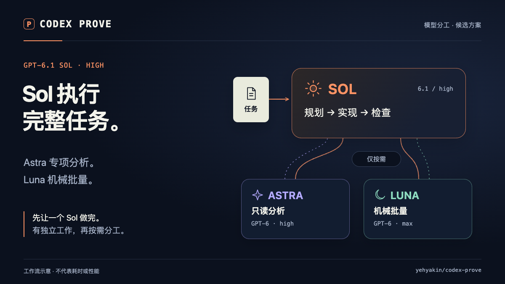
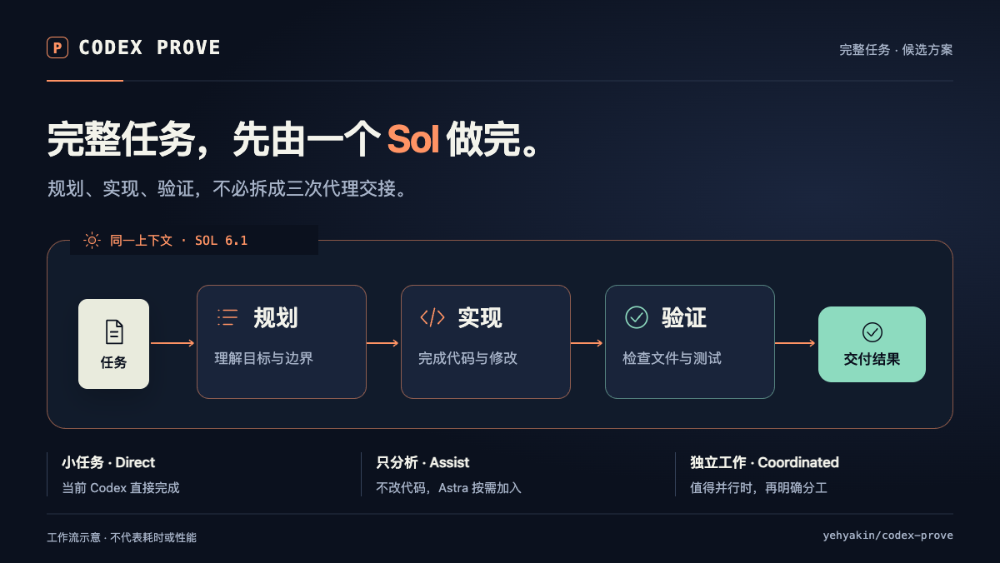

# LiveCanvas 候选配图

> 制作档案：下文“候选／未发布”及 manifest 状态记录 2026-10-01 接入检查时的事实，不表示当前发布状态。当前版本以 [v1.2.0 Release](https://github.com/yehyakin/codex-prove/releases/tag/v1.2.0) 为准；素材、日期与哈希保持不变。

这里保留原版两种主题，中英文各一版。[新版三种主题](polish/README.md) 位于独立目录。
[成本机制图](cost/README.md) 另行说明降本目标，不使用未经验证的节省比例。
PNG 用于静态配图；GIF 用于动态预览。项目中英文 README 已接入新版分工、交付、写入归属及[成本预算图](cost-budget/README.md)，尚未发布。本目录原版素材与四张旧 SVG 保留，不再作为首页配图。

| 主题 | 中文 | English |
| --- | --- | --- |
| 模型分工 | [PNG](roles-zh.png) / [GIF](roles-zh.gif) | [PNG](roles-en.png) / [GIF](roles-en.gif) |
| 完整任务 | [PNG](solo-zh.png) / [GIF](solo-zh.gif) | [PNG](solo-en.png) / [GIF](solo-en.gif) |

事实对应 2026-10-01 的 `f4dba1c` 候选源码，不包含成本、速度或隔离能力的未验证承诺。
动画速度、卡片数和路径是示意，不是测量数据。不同语言不计为新增主题。

[可编辑工程、MP4 与 Live Photo 重建说明](../../../visuals/livecanvas/README.md) · [来源与许可](../../../visuals/livecanvas/sources.md)

制作采用 [LiveCanvas](https://github.com/pengchujin/livecanvas) 流程；原创示意图，没有复制上游演示媒体。MIT 模板与工具许可保留在工程中，Remotion 使用其自身许可。
`manifest.json` 保存实际文件大小和 SHA-256。
