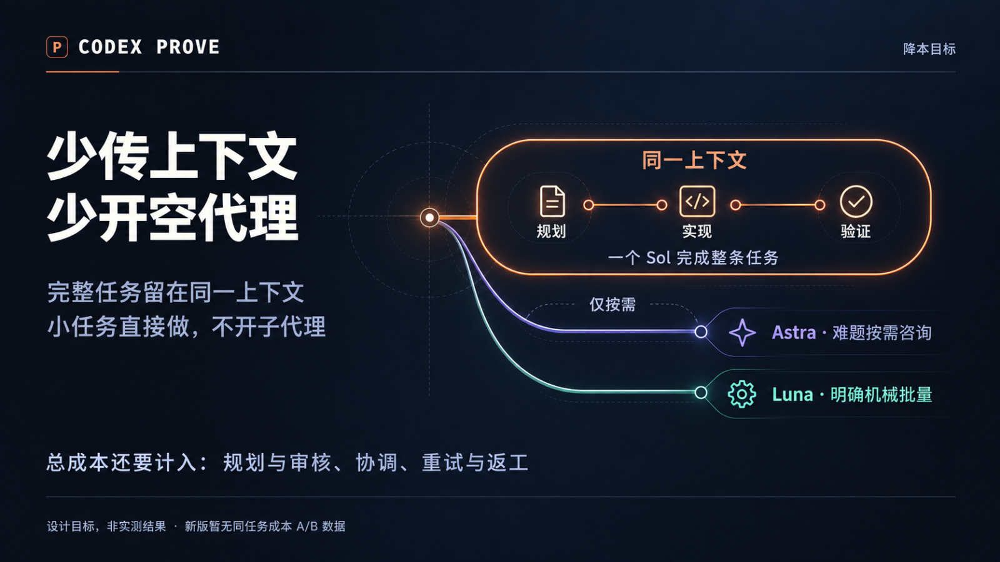

# 降本机制图

> 制作档案：下文“候选／未发布”及 manifest 状态记录 2026-10-01 接入检查时的事实，不表示当前发布状态。当前版本以 [v1.2.0 Release](https://github.com/yehyakin/codex-prove/releases/tag/v1.2.0) 为准；素材、日期与哈希保持不变。

少传上下文、少开空代理：完整任务在同一上下文完成，辅助模型仅按需参与。
这是一项设计目标，不是实测降幅。当前 Sol 6.1 候选没有同任务成本 A/B 结论；旧版 62.3% 预算不适用。

| 中文 | English |
| --- | --- |
| [PNG](cost-zh.png) / [6 秒 GIF](cost-zh.gif) | [PNG](cost-en.png) / [6-second GIF](cost-en.gif) |

[事实来源](../../../../visuals/livecanvas/sources-cost.md) · [生成提示词](../../../../visuals/livecanvas/public/media/cost/cost-prompts.md) · [检查记录](../../../../visuals/livecanvas/QA-cost.md)

图片使用内置 ImageGen 生成，动效由本地 Remotion 渲染。中英文属于同一主题。
`manifest.json` 保存四个 PNG/GIF 的文件大小与 SHA-256。本组机制图保留为备选；项目 README 已接入独立的[成本预算版](../cost-budget/README.md)，尚未发布。
