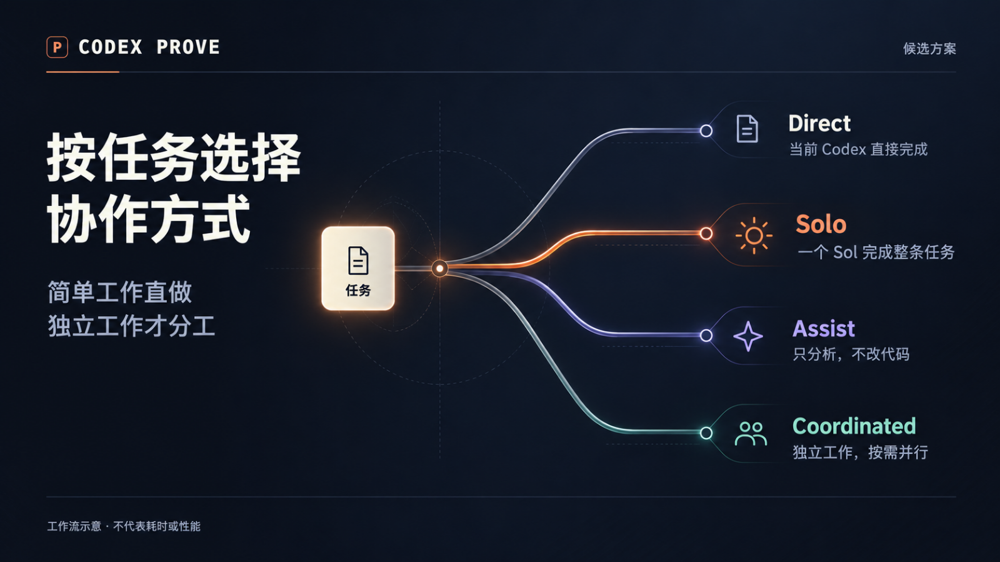
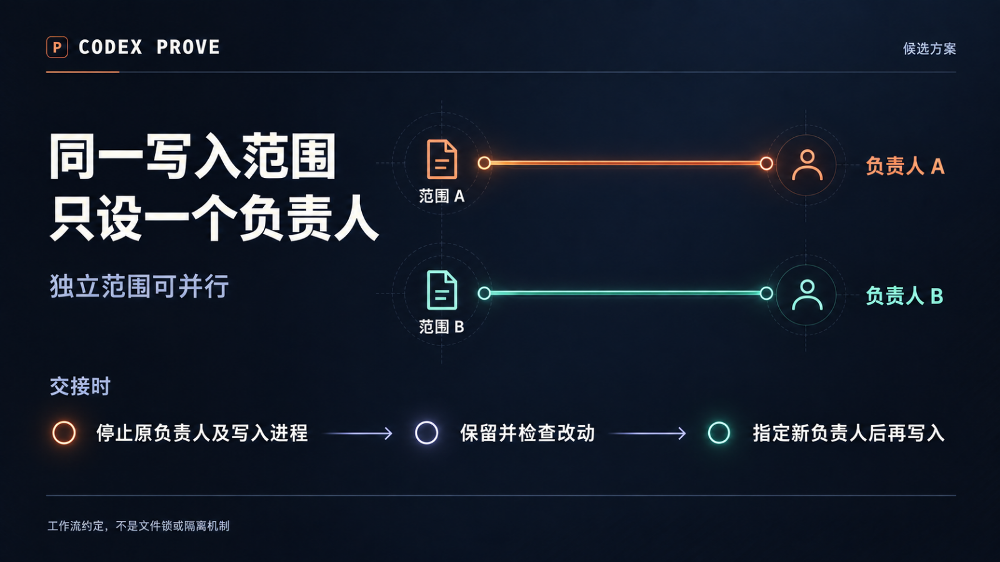
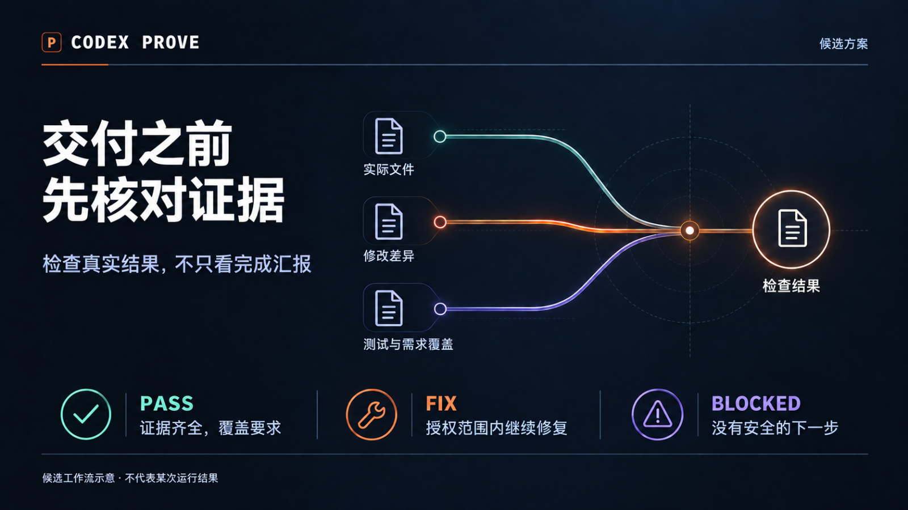

# 新版配图

> 制作档案：下文“候选／未发布”及 manifest 状态记录 2026-10-01 接入检查时的事实，不表示当前发布状态。当前版本以 [v1.2.0 Release](https://github.com/yehyakin/codex-prove/releases/tag/v1.2.0) 为准；素材、日期与哈希保持不变。

沿用用户选定的第一稿：深蓝底、浅色标题、细线光路。
三种主题，中英文各一版。PNG 是静态封面；GIF 是 6 秒循环动效。

| 主题 | 中文 | English |
| --- | --- | --- |
| 按任务选路 | [PNG](routing-zh.png) / [GIF](routing-zh.gif) | [PNG](routing-en.png) / [GIF](routing-en.gif) |
| 写入负责人 | [PNG](ownership-zh.png) / [GIF](ownership-zh.gif) | [PNG](ownership-en.png) / [GIF](ownership-en.gif) |
| 交付验真 | [PNG](evidence-zh.png) / [GIF](evidence-zh.gif) | [PNG](evidence-en.png) / [GIF](evidence-en.gif) |

内容对应 2026-10-01 的 `f4dba1c` 候选源码，不是发布证明或实测结果。
这些配图已接入本地中英文 README：分工与交付图在正文，写入负责人图在折叠说明中；PNG 内嵌、GIF 按需打开。尚未发布，原版文件保留在上一级目录。

[工程与重建](../../../../visuals/livecanvas/README.md) · [来源与生成提示词](../../../../visuals/livecanvas/sources-polish.md) · [画面对照检查](../../../../visuals/livecanvas/design-qa.md)

`manifest.json` 保存 12 个 PNG/GIF 文件的实际大小与 SHA-256。
MP4 和 Live Photo 资源包在本地工程的 `out/` 目录，不包含在本目录中。
